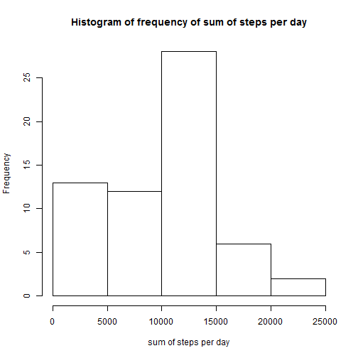
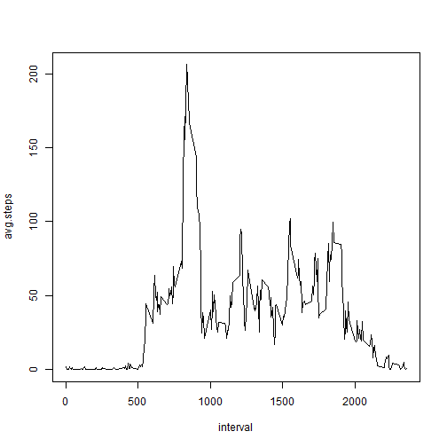
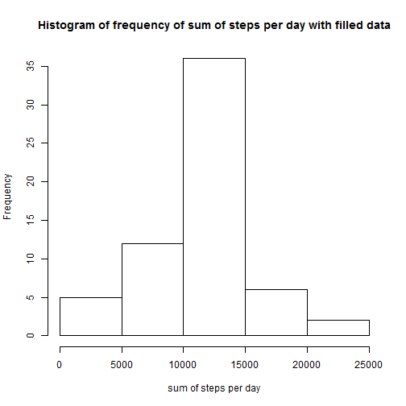
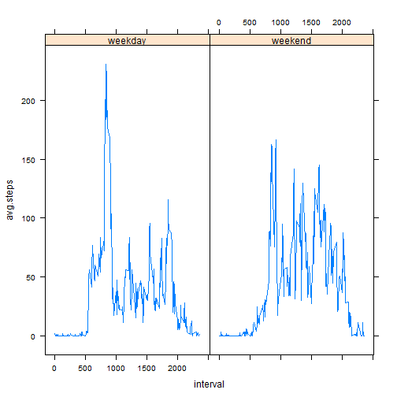

Reproducible Research Course Project 1 Assignment
========================================

Prepare the environment

```r
library(dplyr)
library(tidyr)
library(ggplot2)
library(lubridate)
library(lattice)

Sys.setlocale("LC_TIME", "English")
```

```
## [1] "English_United States.1252"
```

```r
set.seed(1)
```

Load the data

```r
#load the data
data1<-read.csv("C:/Users/dingjunjie/Desktop/ML/CourseraDataScience/repdata%2Fdata%2Factivity/activity.csv",stringsAsFactors = F)
data2<-data1
```

Make a histogram of the total number of steps taken each day

```r
#mean steps per day
data1_summary<-data1%>%group_by(date)%>% summarise(sum(steps,na.rm=T),mean(steps,na.rm=T),median(steps,na.rm=T))
hist(data1_summary$`sum(steps, na.rm = T)`,xlab="sum of steps per day",main="Histogram of frequency of sum of steps per day")
```


Calculate and report the mean and median total number of steps taken per day

```r
data1_summary
```

```
## # A tibble: 61 x 4
##    date     `sum(steps, na.rm ~ `mean(steps, na.rm ~ `median(steps, na.rm~
##    <chr>                  <int>                <dbl>                 <dbl>
##  1 2012-10~                   0              NaN                        NA
##  2 2012-10~                 126                0.438                     0
##  3 2012-10~               11352               39.4                       0
##  4 2012-10~               12116               42.1                       0
##  5 2012-10~               13294               46.2                       0
##  6 2012-10~               15420               53.5                       0
##  7 2012-10~               11015               38.2                       0
##  8 2012-10~                   0              NaN                        NA
##  9 2012-10~               12811               44.5                       0
## 10 2012-10~                9900               34.4                       0
## # ... with 51 more rows
```


Plot trends of average steps per interval

```r
#max steps of interval
data1_interval<-data1%>%group_by(interval)%>%summarise(avg.steps=mean(steps,na.rm=T),median.steps=median(steps,na.rm=T))
with(data1_interval,plot(interval,avg.steps,type="l"))
```



Caculate which interval contains the maximum number of steps

```r
data1_interval$interval[which.max(data1_interval$avg.steps)]
```

```
## [1] 835
```
Check missing values

```r
summary(data2)
```

```
##      steps            date              interval     
##  Min.   :  0.00   Length:17568       Min.   :   0.0  
##  1st Qu.:  0.00   Class :character   1st Qu.: 588.8  
##  Median :  0.00   Mode  :character   Median :1177.5  
##  Mean   : 37.38                      Mean   :1177.5  
##  3rd Qu.: 12.00                      3rd Qu.:1766.2  
##  Max.   :806.00                      Max.   :2355.0  
##  NA's   :2304
```
From above result we can see there are some missing values in varibale steps. Considering steps will be similar in same intervals in different days, we decide to use to average steps in each day to impute the missing data.
Imputing missing values

```r
#Imputing missing values
index<-which(is.na(data2$steps))
data2_interval<-data2%>%group_by(interval)%>%summarise(avg.steps=mean(steps,na.rm=T),median.steps=median(steps,na.rm=T))
for (i in index)
{data2$steps[i]<-data2_interval$avg.steps[data2_interval$interval==data2$interval[i]]}
data2_summary<-data2%>%group_by(date)%>% summarise(sum(steps,na.rm=T),mean(steps,na.rm=T),median(steps,na.rm=T))
hist(data2_summary$`sum(steps, na.rm = T)`,xlab="sum of steps per day",main="Histogram of frequency of sum of steps per day with filled data")
```




```r
#weekday analysis
data2$weekday<-weekdays(as.Date(data2$date))
data2$is.weekday<-ifelse(data2$weekday %in% c("Saturday","Sunday") , "weekend" , "weekday")
data2_summary_weekday<-data2%>%group_by(is.weekday,interval)%>% summarise(avg.steps=mean(steps,na.rm=T))
xyplot(avg.steps~interval|is.weekday,type="l",data=data2_summary_weekday)
```


From above graphs, there is no obvious pattern between weekday and weekend result.
